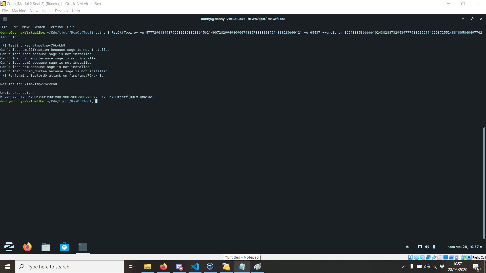

# RSABC
## Description 
I was just listening to some <a href=https://youtu.be/J2g3lvNkAfI>relaxing ASMR</a> when a notification popped up with <a href=https://static.tjctf.org/68f148e8d4b5ceb8f9fa6da568db024c28b80b55891fba49880b76b35d436114_rsa.txt>this</a>.

???
## Solution
Kita mengetahui dari judul challenge bahwa ini merupakan problem yang berkaitan dengan enkripsi asimetrik RSA.
Dari rsa.txt kita dapatkan:
 
n=57772961349879658023983283615621490728299498090674385733830087914838280699121
 
e=65537
 
c=36913885366666102438288732953977798352561146298725524881805840497762448828130
 
Kita menggunakan tool `RsaCtfTool` untuk mendekripsikan ciphertext dari enkripsi ini.

## Flag
tjctf{BOLm1QMWi3c}