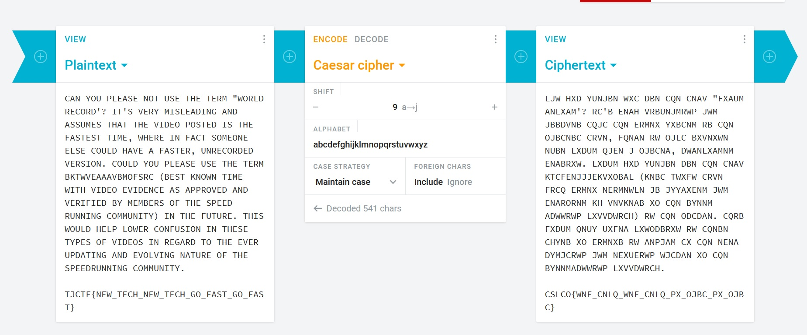

# Speedrunner
## Description 
I want to make it into the hall of fame -- a top runner in "The History of American Dad Speedrunning". But to do that, I'll need to be faster. I found some <a href=https://static.tjctf.org/6e61ec43e56cff1441f4cef46594bf75869a2c66cb47e86699e36577fbc746ff_encoded.txt>weird parts</a> in the American Dad source code. I think it might help me become the best.

## Solution
Dari file tersebut, kita mendapatkan ciphertext seperti ini:
LJW HXD YUNJBN WXC DBN CQN CNAV "FXAUM ANLXAM'? RC'B ENAH VRBUNJMRWP JWM JBBDVNB CQJC CQN ERMNX YXBCNM RB CQN OJBCNBC CRVN, FQNAN RW OJLC BXVNXWN NUBN LXDUM QJEN J OJBCNA, DWANLXAMNM ENABRXW. LXDUM HXD YUNJBN DBN CQN CNAV KTCFENJJJEKVXOBAL (KNBC TWXFW CRVN FRCQ ERMNX NERMNWLN JB JYYAXENM JWM ENARORNM KH VNVKNAB XO CQN BYNNM ADWWRWP LXVVDWRCH) RW CQN ODCDAN. CQRB FXDUM QNUY UXFNA LXWODBRXW RW CQNBN CHYNB XO ERMNXB RW ANPJAM CX CQN NENA DYMJCRWP JWM NEXUERWP WJCDAN XO CQN BYNNMADWWRWP LXVVDWRCH. 

CSLCO{WNF_CNLQ_WNF_CNLQ_PX_OJBC_PX_OJBC}

Karena tidak ada kunci terlihat, maka kita asumsikan metode enkripsi adalah Caesar Cipher. Kita dekripsi dengan <a href=https://cryptii.com/pipes/caesar-cipher>Cryptii</a>. Kemudian kita dapatkan plaintext-nya dengan kunci 9:
  

## Flag
TJCTF{NEW_TECH_NEW_TECH_GO_FAST_GO_FAST}