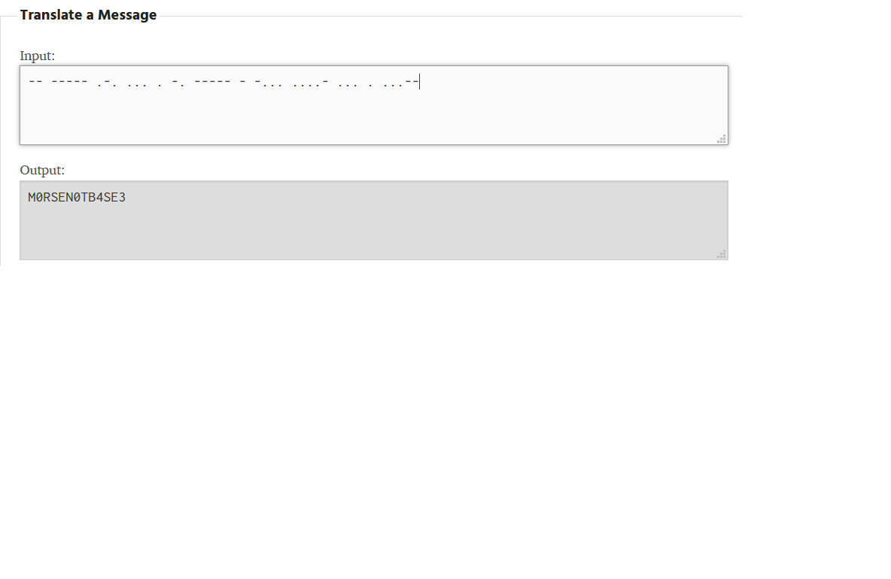

# Tap Dancing
## Description 
My friend is trying to teach me to dance, but I am not rhythmically coordinated! They sent me a list of <a href=https://static.tjctf.org/518d6851c71c5482dbd5bbe812b678684238c8f4e9e9b3d95a188f7db83a0870_cipher.txt>dance moves</a> but they're all numbers! Can you help me figure out what they mean so I can learn the dance?

NOTE: Flag is not in flag format. 

## Solution
Setelah kita buka file-nya, kita dapatkan angka ini: 1101111102120222020120111110101222022221022202022211. Mengetahui bahwa soalnya memiliki hubungan dengan ritme, maka kemungkinan yang terpikir adalah morse code. Dengan pencarian lebih lanjut, dapat kita simpulkan bahwa:
0 =  
 
1 = -
 
2 = .
 
Dengan begitu, kita bisa dekripsikan sehingga kita dapatkan flag-nya.

## Flag
M0RSEN0TB4SE3