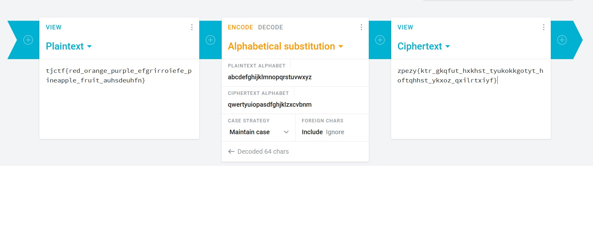

# Typewriter
## Description 
Oh no! I thought I typed down the correct flag for this problem on my typewriter, but it came out all jumbled on the paper. Someone must have switched the inner hammers around! According to the paper, the flag is zpezy{ktr_gkqfut_hxkhst_tyukokkgotyt_hoftqhhst_ykxoz_qxilrtxiyf}.

## Solution
Dapat kita asumsikan bahwa zpezy adalah tjctf. Namun, untuk yang lain kita belum tahu bagaimana cara mendekripsikannya. Kemudian, kita menilik lagi nama dari challenge, yaitu typewriter. Siapa di zaman seperti ini masih menggunakan typewriter dengan inner hammer? Maka kita dapat mengetahui kemungkinan bahwa typewriter yang dipakai adalah typewriter yang sangat lama. Sehingga kita bisa coba dengan <a href=https://cryptii.com/pipes/alphabetical-substitution>Cryptii</a> untuk mendapatkan flag-nya.

## Flag
tjctf{red_orange_purple_efgrirroiefe_pineapple_fruit_auhsdeuhfn}