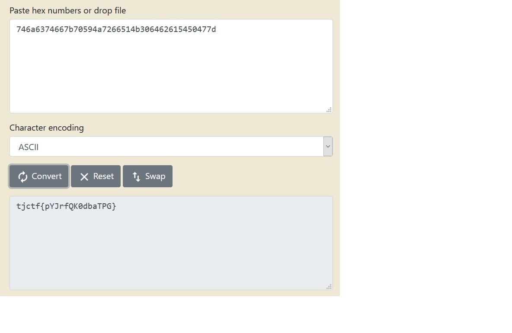

# Hexillology
## Description 
I recently designed a new flag for my imaginary nation, Hexistan. Do you like it?

## Solution
Pertama-tama kita coba scan dengan menggunakan `file` dan ternyata benar image adalah PNG. Kemudian kita cek metadata-nya dengan menggunakan `exiftool`, namun tidak ditemukan hal menarik. Lalu, kita coba mencari hex code dari gambar dengan menggunakan <a href=https://imagecolorpicker.com/en>ImageColorPicker</a>. Kemudian, kita dapatkan hex code dari masing-masing warna yang ada dalam gambar:
 
#746a63, #74667b, #70594a, #726651, #4b3064, #626154, #50477d. Lalu kita gabungkan menjadi: 746a6374667b70594a7266514b306462615450477d.
 
Kita convert dan kita dapatkan flag-nya.

## Flag
tjctf{pYJrfQK0dbaTPG}